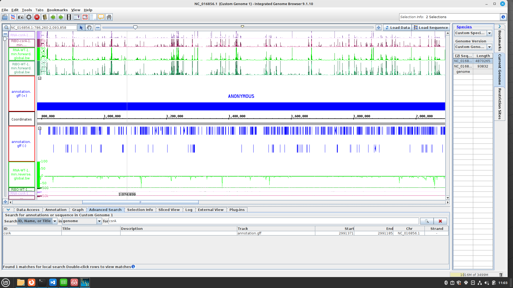
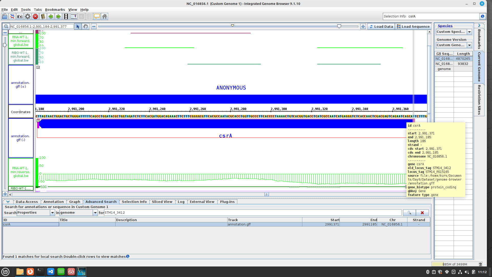
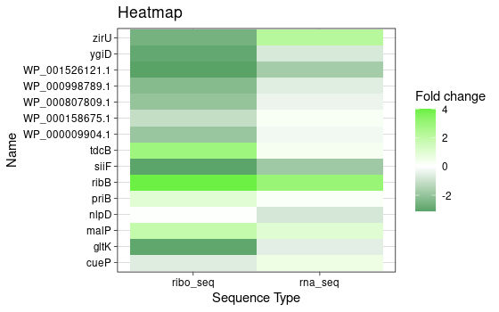
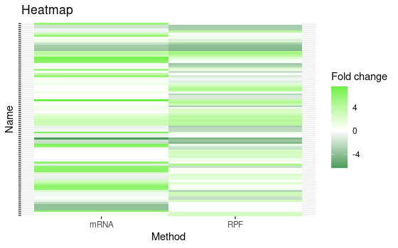

# Day 9

Conda Problem still there so we installed:
```
conda install -c bioconda bioconduct-deseq2 -y
conda install -c bioconda segemehl -y
conda install -c r r-gplots -y
```
### IGB
Data today from Potts et. al.
`Role of CsrA in stress responses and metabolism important for Salmonella virulence revealed by integrated transcriptomics`

load your reference sequence (.fa) and annotation (.gff) in the IGB. Than you can open yoour samples (.bw). 

`Task: Search for STM14_3412` 
Questions
1) Its start codon (canocial ATG or alternative GTG,TTG)
2) Its stop codon (TAG, TGA, TAA)
3) Its length in amino acids
4) Its SD (Shine-Dalgano sequence)(consensus AGGAGG at -7 to -4)
5) The mame of the upstream gene
6) Do you think csrA is translated? Why?

Answers
1) TAC so canonical ATG
2) ATT so canonical TAA
3) 186 nucleotides so 61 amino acids (Stop codon is no amino acid)
4) AGGAG at -7
5) STM14_3413
6) Yes coverage of wt is there.

After that we learned many things about Ribo-seq, RNA-seq and the tables from our dataset and the p-values in it. We looked some genes in IGB up an searched for coverage.

Then we get back to R Studio with our tables. We made two different Heatmaps. One with the whole data and one with the ones with names.

First we activate ggplot
```
library(ggplot2)
```
Then we loaded our data and defined it:
```
df <- read_excel('csrA-WT_sorted.xlsx', sheet = 'Sheet4')
```
After that we made a first plot with the small dataset:
```
ggplot(df, aes(df$seq_type, df$name, fill=df$log2fold_change))+geom_tile()+
  scale_fill_gradient2(low = '#14883e', mid = 'white', high = '#6bf043')+
  theme_linedraw()+
  labs(x='Sequence Type', y = 'Name', fill = 'Fold change', title = 'Heatmap')
  ```

  And then did the same with the whole data.
  ```
df1 <- read_excel('csrA-WT_sorted.xlsx', sheet = 'Sheet5')  
```
```
ggplot(df1, aes(df1$seq_type, df1$Identifier, fill=df1$log2fold_change))+geom_tile()+
  scale_fill_gradient2(low = '#14883e', mid = 'white', high = '#6bf043')+theme(axis.text.y = element_blank())+
  labs(x='Method', y = 'Name', fill = 'Fold change', title = 'Heatmap')
```

We also learned this command to gather our big data, if you didnt do it manuel in excel.
```
df1 <- tidyr::gather(df1, key = 'Identifier', value = 'log2_fold')
```

