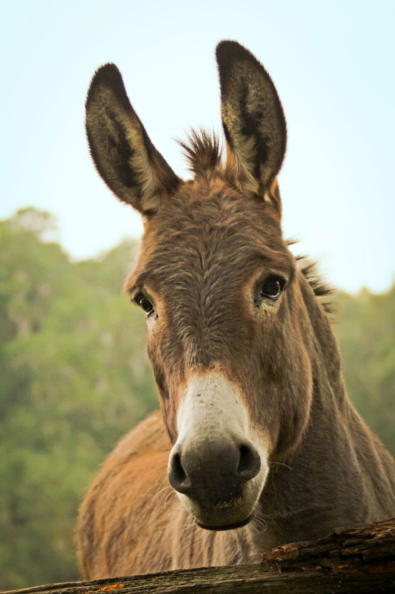

# Day 3
### 

Tody we learned:

How to put a image in the Text:
```
![image]
```


And to put a link in a compressed way:
```
[link](www.xxx.com)
```

In this [link](https://www.google.com/search?q=esel&client=firefox-b-lm&source=lnms&tbm=isch&sa=X&ved=2ahUKEwiL0r3usOL8AhUyRvEDHTEdBbsQ_AUoAXoECAEQAw&biw=1920&bih=927&dpr=1) you can see many cute donkeys.

Than we startet with from contigs to binning:

We visualizated the asembly with:
```
megahit_toolkit contig2fastg 99 final.contigs.fa > final.contigs.fastg                   
```
It looked like this 
 And if you zoom in you see this 

And did a Quality Assessment of Assemblies:
```
metaquast -t 6 -o /PATH/TO/3_metaquast -m 1000 final.contigs.fa
```
For the QUAST we get a file and had to anwser some questions. 

The Questions to that were:

    What is your N50 value? Why is this value relevant?
    How many contigs are assembled?
    What is the total length of the contigs?

Aners:

1. 2963
2. x
3. 57.414
4. 145.675.865

### Genomes Binning
For the mapping we used:
```
source activate /home/sunam226/.conda/envs/anvio
#conda activate anvio

cd /work_beegfs/sunam234/Day_3/2_fastp/

for i in `ls *mapped_R1.fastq.gz`;
do
    second=`echo ${i} | sed 's/_R1/_R2/g'`
    bowtie2 --very-fast -x /work_beegfs/sunam234/Day_3/3_coassembly/contigs.anvio.fa.index -1 ${i} -2 ${second} -S ../4_mapping/"$i".sam 
done

#this prints the required resources into your logfile
jobinfo
```
Last we had to but sam file into bam file.
```
module load samtools

cd /PATH/TO/MAPPING/OUT
for i in *.sam; do samtools view -bS $i > "$i".bam; done
```


