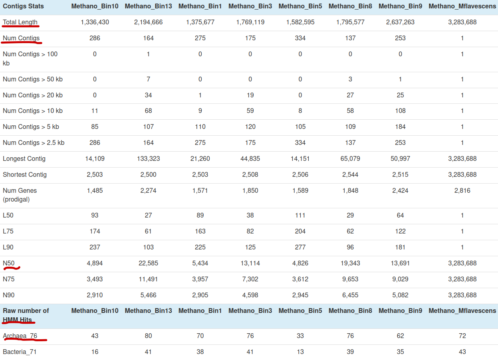
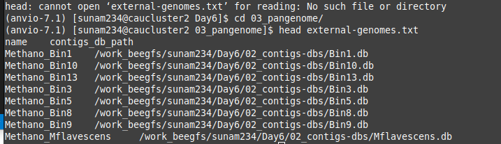
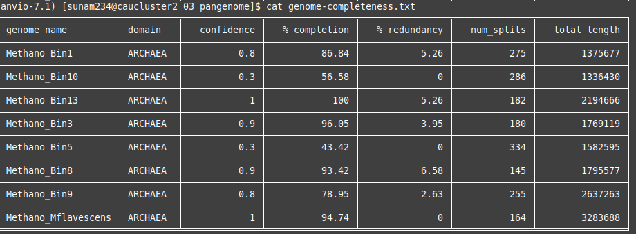
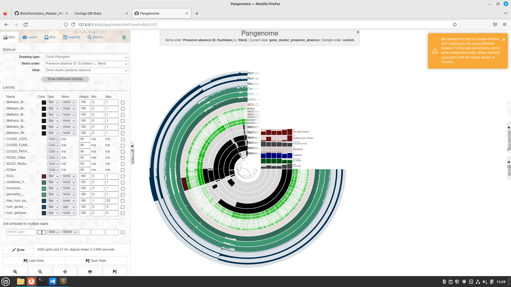
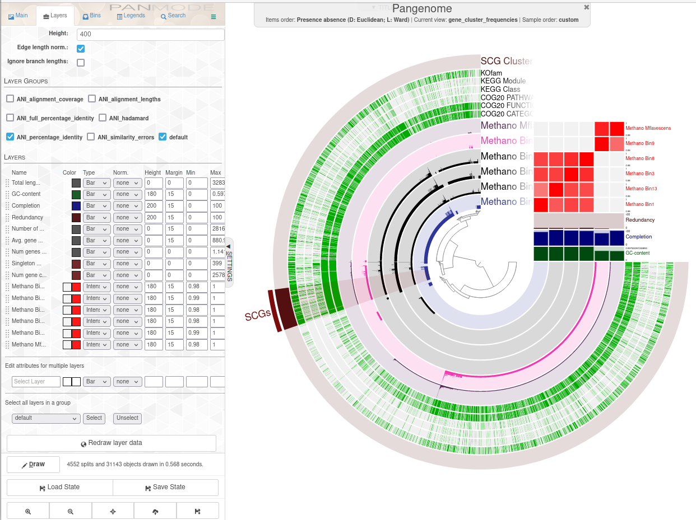
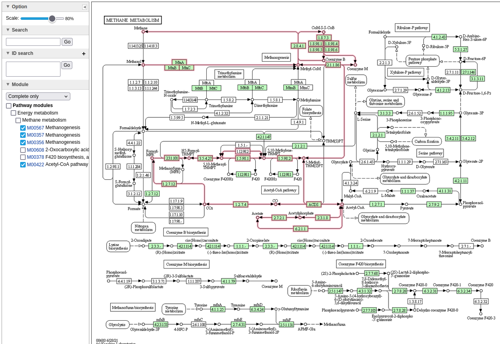
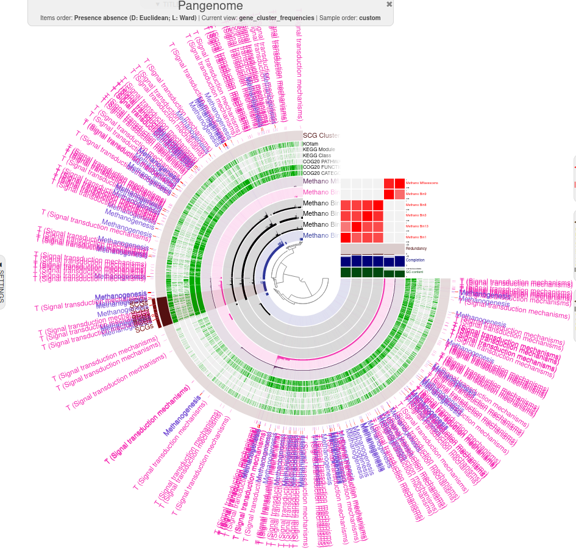
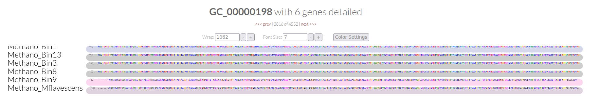
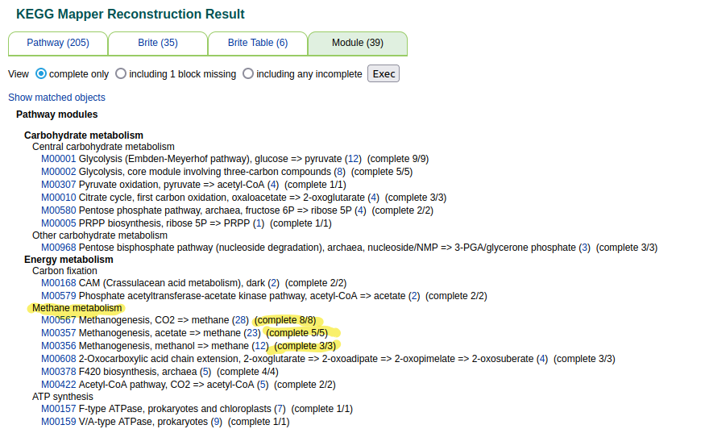
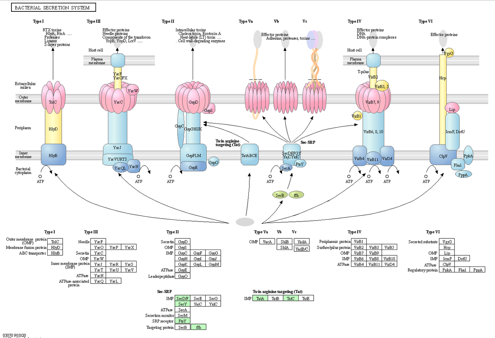

# Day 6

### Pangenomics
### Evaluation of our starting databases

First we started the interactive interface 
```
srun --reservation=biol217 --pty --mem=10G --nodes=1 --tasks-per-node=1 --cpus-per-task=1 /bin/bash
```
It gives us a node which we can than use. Than we have to activate conda:
```
conda activate /home/sunam225/miniconda3/miniconda4.9.2/usr/etc/profile.d/conda.sh/envs/anvio-7.1
```
Than we said which data we wanted to have visulized:
```
anvi-display-contigs-stats *db
```
Therefor you need to be in the right directory.

Then we needed to open a new Terminal an start the tunnel:
```
ssh -L 8060:localhost:8080 sunamxxx@caucluster-old.rz.uni-kiel.de
ssh -L 8080:localhost:8080 node{#}
```
After that you can open the given IP. 

### Questions
1) How do the MAGs compare in size and number of contigs to the full genome?
2) Based on the contig numbers, sizes and number of marker genes (HMM hits), which two MAGs are the best and which is the worst?

### Answers
1) Higher number of contigs, and lower N50 (size of contigs)
2) best MAG should have low number of contigs but in big size.
   I would say bin 13 and 9 are the two best, They have the biggest sizes of contigs and also a good number of contigs. The HMM shows more archaea than bactera or protista. Bin 9 is a bit longer than Bin8, so I choose it. 

   The two worst bins are Bin 5 and Bin 10 they have a real short size of contigs. Bin 5 high number of contigs, but the lowest N50 and the lowest HMM hits for archaea. 

### Making a Pangenome
We want to compare some genome databases. 
```
anvi-script-gen-genomes-file --input-dir 02_contigs-dbs/ -o ./03_pangenome/external-genomes.txt
```


We wanted to specifically look at redundancy and completness.
Therefor we used the command:
```
anvi-estimate-genome-completeness -e external-genomes.txt > genome-completeness.txt
```

### Questions
 How do the bins compare to isolate genomes? Would you remove one, based on the output of the completeness estimation?

 ### Answers
 The bins with > 70% completion and < 10% redundancy are good to use. The Bins lower that can be removed. Here it was Bin 10 and 5.

Next we moved the bad Bins out of our file.
Than we recreated the external genome.
```
anvi-script-gen-genomes-file --input-dir 02_contigs-dbs/ -o ./03_pangenome/external-genomes-final.txt
```
We wanted to create the pangenome database, therefore we had to change some of our BATCH skript:
change SBATCH Settings: --nodes=1, --cpus-per-task=10, --mem=500M, --time=00:05:00

Afterward we set the command to create a pangenome database:
```
anvi-gen-genomes-storage -e external-genomes-final.txt -o Methano-GENOMES.db
anvi-pan-genome -g Methano-GENOMES.db --Pangenome --num-threads 10
```
### Genome similarity based on average nucleotide identity (ANI)

Than we looked for genome similarity based on average nucleotide identity (ANI), therfore we need to adjust the parameters at our BATCH skript to:
SBATCH Settings: --nodes=1, --cpus-per-task=10, --mem=600M, --time=00:02:00

And run the BATCH skript with the command:
```
anvi-compute-genome-similarity --external-genomes external-genomes-final.txt --program pyANI --output-dir ANI --num-threads 10 --pan-db /work_beegfs/sunam234/Day6/03_pangenome/Pangenome/Pangenome-PAN.db
```
### Visualizing the pangenome
First access to HPC
```
srun --pty --mem=10G --nodes=1 --tasks-per-node=1 --cpus-per-task=1 --reservation=biol217 --partition=all /bin/bash
```
Than we needed to do the pangenome command:
```
 anvi-display-pan -p Pangenome/Pangenome-PAN.db -g Methano-GENOMES.db -P 8086
```

### Questions
What is the -P flag for?
### Answers
P INT, --port-number INT
  Port number to use for anvi'o services. If nothing is declared, anvi'o will try to find a suitable port number, starting from the default port number, 8080. (default: None)

Than you need again to log in on caucluster in an new terminal. Therfore we used this Time different ports.
```
ssh -L 8060:localhost:8080 sunamXXX@caucluster-old.rz.uni-kiel.de 
ssh -L 8080:localhost:8080 nodeXXX
```
Entering the IP it shows you the Pangenome. 

### Interpreting and ordering the pangenome 

### Questions ***TASK Genome similarity***

1) Based on the frequency clustering of genes, do you think all genomes are related? Why?
2) How does the reference genome compare to its closest bin? Tip: Consider the genome depiction and layers above
3) What ranges are used determine a prokaryotic species? How high can you go until you see changes in ANI? What does the ANI clustering tell you about genome relatedness?


### Answers
1) No I dont think they are all related, because it is splited up in two different phylogenetic trees.
2) The GC content is really simmilar. In most of the parte the frequence is nearly simmilar, but in some other parts you can clearly see that they have no single copy core gens.
3) The species cut-off is at 95% all up higher is the same species. You have to go up until 0.98 to see a little change. 0.99 is a clear change shown. The ANI clustering tells me, wich genomes are simillar and from the same species. 



### Questions ***TASK ´Functional Profiling***
1) How are Methanogenesis genes distributed across the genome?

### Answers



***FINAL view of COG Categorie T Signal transduction mechanisms***



### Questions ***TASK Functional/geometric homogeneity and their uses***
1) What observations can you make regarding the geometric homogeneity between all genomes and the functional homogeneity?

### Answers
1) The last two and the first four together have relative close geometric homogeneity. They starts at the same and most of the AA are similar. 


### Questions ***BONUS BlastKoala***
1) Can the organism do methanogenesis? 
2) Does it have genes similar to a bacterial secretion system?
   
### Answers
1) Yes it can do methanogenesis. 
2) Yes the Sec and Tat of the secretion system from bacteria would probably work. 